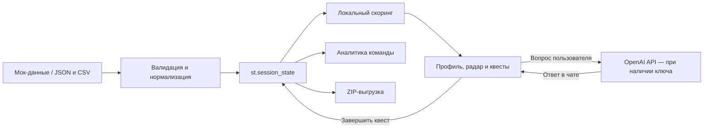

# Career Space

**Платформа развития сотрудников: от разрыва в навыках до понятного следующего шага.**

Career Space — прототип для хакатона, который сопоставляет навыки сотрудника с требованиями следующего грейда, рекомендует учебные активности и показывает прогресс через квесты, XP и достижения. HR и руководители видят дефицит компетенций и участие команды в обучении.

**Для жюри:** запустите приложение и нажмите **«Войти в Демо-режим (для жюри)»**. Регистрация, пароль и API-ключ для основного сценария не нужны. Встроены **6 сотрудников, 13 активностей и 12 записей истории**.

[Репозиторий проекта](https://github.com/BAITC-Hacks/hack-4f7b4401-techmind)

## 1. Какую проблему решает проект

Сотруднику бывает непонятно, какие навыки нужны для следующего грейда и какую активность выбрать первой. HR и руководителю нужен общий обзор: где у команды самые большие разрывы и насколько активно сотрудники развиваются.

Приложение превращает профиль, требования грейда и историю участия в список конкретных действий с объяснимым приоритетом. Основной пользовательский сценарий — развитие сотрудника; при регистрации можно указать стаж от 1 до 5 лет. Дополнительно реализованы учебные кабинеты контакт-центра.

## 2. Что реализовано

- **Демо для жюри:** вход без пароля, выбор сотрудника, переключение на HR-дашборд, загрузка четырёх файлов, восстановление мок-данных и ZIP-выгрузка.
- **Вход и регистрация:** шесть ролей, отдельные экраны и навигация. Пароли хранятся как хеши PBKDF2-HMAC-SHA256 с индивидуальной солью.
- **Личный профиль:** должность, текущий и целевой грейд, стаж, аватар с инициалами и самооценка навыков по шкале 0–5. У нового аккаунта навыки изначально равны нулю.
- **Рекомендации:** до трёх активностей для разных навыков, многофакторное ранжирование, краткое обоснование и раскрываемая детализация расчёта.
- **Интерактивные квесты:** завершение активности увеличивает навык в пределах лимита, записывает результат в историю и пересчитывает рекомендации.
- **Геймификация:** XP, игровые уровни, четыре достижения, серия учебных дней и календарь активности за 12 недель.
- **Визуализация:** радар текущих навыков и требований целевого грейда, метрики и таблицы. При недоступности Plotly используется стандартный график Streamlit.
- **Аналитика команды:** средний и суммарный дефицит навыков, сотрудники с разрывами, фильтр по величине разрыва, вовлечённость и выгрузка таблицы дефицита в CSV.
- **AI-помощник:** плавающий чат, быстрые вопросы, история отдельно для каждого `employee_id`, очистка диалога и повтор запроса после ошибки.
- **Контакт-центр:** создание обращений, ответы оператора, назначение исполнителя и статусы «Новое», «В работе», «Решено».
- **Оформление:** тёмная тема, адаптивные карточки и локальные логотипы; при ошибке загрузки логотипов остаётся текстовое название.

### Роли и доступные экраны

| Роль | Возможности |
| --- | --- |
| Сотрудник | Собственный профиль, самооценка навыков, квесты и AI-помощник |
| HR-специалист | Аналитика всех подразделений в текущей сессии и собственный профиль |
| Руководитель подразделения | Аналитика своего подразделения и собственный профиль |
| Клиент контакт-центра | Создание и просмотр своих обращений; карьерный профиль не создаётся |
| Оператор | Собственный профиль и работа с очередью обращений |
| Супервизор | Аналитика контакт-центра, очередь обращений и собственный профиль |

Демо и зарегистрированные аккаунты используют отдельные наборы данных. Компания в режиме аккаунтов сначала пуста и пополняется при регистрации сотрудников в той же сессии. Сброс демо не удаляет их личный прогресс.

## 3. Как работает решение

1. Пользователь входит в демо или регистрируется и выбирает роль.
2. Приложение получает профиль, каталог активностей, историю участия и требования грейдов. В демо они создаются функцией `mock_data()`; жюри может заменить их файлами.
3. Данные проходят валидацию и нормализацию и сохраняются в `st.session_state`.
4. Для каждого навыка рассчитывается разрыв относительно целевого грейда. Подходящие активности ранжируются по формуле ниже.
5. Сотрудник получает до трёх квестов, видит ожидаемый прирост и объяснение выбора.
6. Кнопка **«Завершить квест»** обновляет навык и историю. Через `st.rerun()` обновляются XP, достижения, радар, рекомендации и связанные показатели команды.

### Многофакторный скоринг

Основной расчёт выполняется локально и не зависит от OpenAI. Обученной модели ранжирования в проекте нет: используются явные правила и веса.

Обозначения: `current` — текущий уровень навыка, `required` — требование целевого грейда, `gain` и `max_level` — параметры активности, `skip_count` — число записей `SKIPPED` и `REJECTED` для её типа.

```text
gap = max(required - current, 0)
effective_gain = max(0, min(gain, max_level - current, 5 - current))
useful_gain = min(effective_gain, gap)
penalty = 5 × skip_count, если skip_count >= 2; иначе 0

score = 10 × (required / 5)
      + 3 × gap
      - penalty
      + 2 × useful_gain
      + hard_bonus
```

`hard_bonus = 2`, если это активность типа `Hard Skills`, по навыку есть разрыв, а в истории сотрудника не менее двух пропусков или отказов от `Soft Skills`. В остальных случаях бонус равен нулю.

Активности без возможного прироста и уже завершённые активности с известным `event_id` исключаются. При наличии требований также исключаются навыки без разрыва. Из оставшихся выбираются лучшие активности максимум для трёх разных навыков.

Если требования грейда отсутствуют, важность и разрыв принимаются равными нулю, а полезный прирост равен фактическому. Приложение предлагает общее развитие навыков и не рассчитывает покрытие требований грейда. Стаж в формуле скоринга не участвует.

### XP, достижения и показатели

```text
XP = 100 × число завершённых активностей
   + round(50 × сумма текущих уровней навыков)

Игровой уровень = 1 + XP // 250
```

Для XP завершённые активности с одинаковым `event_id` учитываются один раз; старые строки без `event_id` считаются отдельными активностями. Награда квеста включает 100 XP за выполнение и изменение XP за фактический прирост навыка. Самооценка навыков также влияет на общий XP.

| Достижение | Условие |
| --- | --- |
| 🏆 Первая кровь | Хотя бы одна завершённая активность |
| 🎯 System Architect | `System Design` не ниже 3 |
| ⚡ Софт-мастер | Закрыты все целевые навыки, для которых в каталоге есть активности `Soft Skills` |
| 🔥 Стрик | Лучшая серия обучения — не менее трёх дней подряд |

Серия и календарь используют даты `completed_at` в UTC. Записи без даты не создают серию. Игровой уровень не меняет карьерный грейд автоматически.

Вовлечённость считается по строкам истории текущих сотрудников:

```text
Вовлечённость = COMPLETED / (COMPLETED + SKIPPED + REJECTED) × 100%
```

Покрытие цели — отношение суммы достигнутых уровней, ограниченных требованиями по каждому навыку, к сумме требований. Это показатель навыков, а не решение о повышении.

## 4. Технологии

| Компонент | Использование |
| --- | --- |
| Python 3.10+ | Вся прикладная логика в `app.py` |
| Streamlit `>=1.55,<2` | Интерфейс, формы, маршрутизация по состоянию сессии, загрузки, скачивания и чат |
| Pandas `>=2.2,<3` | CSV, история активностей, агрегации и таблицы аналитики |
| Plotly `>=5.20,<7` | Интерактивная диаграмма навыков через `plotly.graph_objects` |
| OpenAI SDK `>=1.30,<3` | Запросы к OpenAI API через Chat Completions |
| `gpt-4o-mini` | Модель AI-консультанта, указанная в коде |
| Стандартная библиотека Python | JSON, ZIP в памяти, даты UTC, хеширование паролей, работа с путями |
| HTML/CSS внутри Streamlit | Карточки, оформление экранов, адаптивная вёрстка и плавающая кнопка чата |

Диапазоны зависимостей зафиксированы в [requirements.txt](requirements.txt). Внешняя база данных и отдельный REST-бэкенд не используются. Единственная реализованная внешняя API-интеграция — OpenAI.

## 5. Архитектура проекта

```text
.
├── app.py                     # Логика, данные, экраны и CSS
├── requirements.txt           # Зависимости Python
├── README.md
├── .gitignore                 # Исключения для секретов, окружения и кэша
├── .streamlit/
│   └── config.toml            # Тёмная тема Streamlit
├── assets/
│   ├── logo_full.png          # Полный логотип для st.logo
│   └── logo_icon.png          # Компактная иконка
└── Brand Logo/
    ├── Frame 1.png            # Дополнительные изображения бренда
    └── Frame 2.png
```

Файл `.streamlit/secrets.toml` при необходимости создаётся локально и исключён из Git. Приложение использует изображения из `assets/`; файлы из `Brand Logo/` в коде не подключены.

| Компонент в `app.py` | Ответственность |
| --- | --- |
| `mock_data()`, `parse_upload()`, `normalize_*()` | Создание примеров, чтение и проверка входных данных |
| `initialize_state()`, `activate_workspace()` | Состояние сессии и переключение между данными демо и аккаунтов |
| `register_user()`, `authenticate_user()`, `route_app()` | Регистрация, вход и выбор экрана по роли |
| `grade_requirements()`, `score_candidates()`, `calculate_recommendations()` | Требования грейда, оценка кандидатов и выбор квестов |
| `complete_activity()`, `gamification_profile()`, `career_achievements()` | Обновление навыков и истории, XP и достижения |
| `render_login()`, `render_profile()`, `render_dashboard()`, `render_demo_mode()` | Основные экраны |
| `render_contact_center()` | Обращения клиентов и работа операторов |
| `request_ai_text()`, `get_ai_explanation()`, `render_ai_mentor()` | API-запросы, локальные объяснения и интерфейс чата |
| `data_archive()` | ZIP-выгрузка четырёх наборов данных |



Состояние хранится в памяти процесса Streamlit отдельно для каждой пользовательской сессии. Переключение ролей выполняется через выход и вход в другой зарегистрированный аккаунт в той же сессии; единой компании между независимыми браузерными сессиями нет.

## 6. Установка и запуск

### Шаг 1. Получить проект

Нужны Python 3.10+ и Git. Для скачивания приватного репозитория потребуется доступ к нему.

```bash
git clone https://github.com/BAITC-Hacks/hack-4f7b4401-techmind.git
cd hack-4f7b4401-techmind
```

Если проект уже открыт локально, выполняйте следующие команды из папки с `app.py`.

### Шаг 2. Создать окружение, установить зависимости и запустить

**Windows / PowerShell:**

```powershell
python -m venv .venv
.\.venv\Scripts\python.exe -m pip install -r requirements.txt
.\.venv\Scripts\python.exe -m streamlit run app.py
```

**Linux / macOS:**

```bash
python3 -m venv .venv
./.venv/bin/python -m pip install -r requirements.txt
./.venv/bin/python -m streamlit run app.py
```

Эти команды не требуют активации окружения. В уже активированном окружении достаточно:

```bash
streamlit run app.py
```

Откройте локальный адрес, который выведет Streamlit, обычно [http://localhost:8501](http://localhost:8501). После установки зависимостей основной сценарий работает без интернета и API-ключа.

### Шаг 3. При необходимости включить ответы OpenAI в чате

Создайте файл `.streamlit/secrets.toml` рядом с существующим `config.toml`:

```toml
OPENAI_API_KEY = "YOUR_OPENAI_API_KEY"
```

Замените заглушку своим ключом. Этот файл уже исключён из Git.

Альтернатива — переменная окружения в терминале, из которого запускается приложение:

```powershell
# PowerShell
$env:OPENAI_API_KEY = "YOUR_OPENAI_API_KEY"
```

```bash
# Linux / macOS
export OPENAI_API_KEY="YOUR_OPENAI_API_KEY"
```

Ключ сначала ищется в Streamlit Secrets, затем в окружении. Отсутствие или ошибка чтения `secrets.toml` не останавливает приложение. Автоматическая загрузка `.env` не реализована. После настройки перезапустите приложение.

Без ключа чат показывает сообщение **«API-ключ OpenAI не задан. Укажите его в .streamlit/secrets.toml»**. Квесты, расчёты, графики и аналитика продолжают работать.

## 7. Как проверить решение: сценарий для жюри

### Основной сценарий без API-ключа

1. Запустите приложение и нажмите **«Войти в Демо-режим (для жюри)»**.
2. Если демо уже изменялось, в сайдбаре нажмите **«Восстановить мок-данные»**.
3. Выберите режим **«Сотрудник»** и профиль **`EMP-001`**. Это Backend Developer, Middle → Senior, стаж 26 месяцев.
4. Найдите квест **«Архитектура распределённых систем»** (`EV-01`) и раскройте **«🔍 Детализация AI-скоринга»**.
5. Проверьте объяснение: `System Design = 2`, для Senior требуется `4`, разрыв равен `2`; реальный прирост — `1`, лимит — `5`. Три пропуска/отказа от `Soft Skills` дают приоритет этому Hard Skill. Итоговый балл квеста — **18**.
6. Нажмите **«Завершить квест»**. Ожидаемые изменения:

   | Показатель | До | После |
   | --- | --- | --- |
   | System Design | 2 | 3 |
   | Общий XP | 650 | 800 |
   | Игровой уровень | 3 | 4 |
   | Достижение System Architect | Закрыто | Открыто |
   | Строк в общей истории | 12 | 13 |

   Награда составляет **150 XP**: 100 за активность и 50 за один пункт навыка. Завершённый `EV-01` больше не предлагается; другой курс по тому же навыку может остаться доступным. В журнале появляется `COMPLETED` с `event_id` и датой UTC.

7. Переключитесь на **«HR-Дашборд»**. Вовлечённость после этого действия — **61,5%** вместо исходных **58,3%**: теперь завершено 8 из 13 активностей истории. Посмотрите дефицит навыков и таблицу сотрудников.
8. Нажмите **«Скачать текущие данные»**. ZIP содержит `employees.json`, `events.json`, `activity_history.csv` и `skills.json`. Для обратной загрузки распакуйте архив и загрузите файлы по отдельности.
9. Вернитесь в режим сотрудника и откройте **«AI-помощник»**. Отправьте вопрос или нажмите быструю подсказку. При настроенном доступе к OpenAI ожидается ответ модели; без ключа появляется уведомление, а приложение остаётся доступным.

В исходной мок-истории нет дат завершения, поэтому она не заполняет календарь и серию учебных дней. Завершение квеста через интерфейс добавляет дату.

### Проверка своих файлов

Нажмите **«Скачать примеры всех 4 файлов»**, распакуйте ZIP и используйте секцию **«Загрузка данных Жюри»**. Каждый загрузчик заменяет только свой набор данных. Подсказки о форматах доступны в сайдбаре.

Для проверки обработки ошибок можно загрузить CSV без обязательной колонки `status`: приложение должно сообщить, что файл не применён, и сохранить прежнюю историю.

### Проверка регистрации и ролей

Вернитесь ко входу, откройте **«Регистрация»**, заполните имя, email, пароль от 8 до 128 символов и выберите роль. Для сотрудника можно задать направление, подразделение, грейд и стаж; после регистрации раскройте **«Начать с самооценки навыков»**.

Чтобы проверить контакт-центр, в **одной сессии браузера** зарегистрируйте клиента, создайте обращение, выйдите и зарегистрируйте оператора с другим email. В разделе **«Контакт-центр»** сохраните ответ со статусом **«Решено»**, затем снова войдите как клиент: ответ должен быть виден в его обращении. Отдельное окно или другая сессия не разделяют эти данные.

## 8. Данные и интеграции

### Источники данных

По умолчанию используются синтетические профили направлений `Backend Developer` и `Data Analyst`, каталог Hard/Soft Skills и матрицы требований грейдов из `mock_data()` в `app.py`. Подключения к корпоративным кадровым системам нет.

Жюри может загрузить собственные данные в демо-режиме. Поддерживается UTF-8, в том числе с BOM; максимальный размер одного файла — **10 МБ**.

| Файл | Основные поля и правила |
| --- | --- |
| `employees.json` | `employee_id`, `role`, `grade`, `next_grade`, словарь `skills` с уровнями 0–5, `tenure_months` |
| `events.json` | `event_id`, `title`, `type`, `skill`, `gain`, `max_level`; обязательны уникальный ID и непустой навык |
| `activity_history.csv` | Обязательны `employee_id`, `event_type`, `status`; статусы: `COMPLETED`, `SKIPPED`, `REJECTED`. Дополнительно: `event_id`, `completed_at` |
| `skills.json` | Требования по грейдам: общие или отдельные для каждой профессиональной роли |

Поле `role` в `employees.json` — **должность**, например `Developer`, а не роль доступа «HR-специалист» или «Сотрудник».

### Минимальный согласованный пример

`employees.json`:

```json
[
  {
    "employee_id": "E1",
    "role": "Developer",
    "grade": "Middle",
    "next_grade": "Senior",
    "skills": {"Python": 2},
    "tenure_months": 18
  }
]
```

`events.json`:

```json
[
  {
    "event_id": "A1",
    "title": "Python Pro",
    "type": "Hard Skills",
    "skill": "Python",
    "gain": 1,
    "max_level": 4
  }
]
```

`activity_history.csv`:

```csv
employee_id,event_type,status
E1,Hard Skills,COMPLETED
E1,Soft Skills,SKIPPED
```

`skills.json`:

```json
{
  "roles": {
    "Developer": {
      "Senior": {"Python": 4}
    }
  },
  "grades": {}
}
```

Для сотрудников и активностей также принимаются оболочки `employees`/`events` и словари по ID. Для требований поддерживаются общий словарь `грейд → навыки` и массив записей с `role`, `grade`, `skills`.

Названия навыков должны совпадать во всех файлах. Должности и грейды сопоставляются без учёта регистра. Требования должности дополняют общие требования и имеют приоритет для совпадающего навыка.

### Валидация и сохранение

- Отсутствующий навык сотрудника считается равным нулю; числовые уровни ограничиваются диапазоном 0–5.
- Для активности без части полей используются, в частности, `gain=1`, `max_level=5`, `type=Other`.
- Некорректные записи могут быть пропущены с предупреждениями. При ошибке разбора файла или непригодном наборе предыдущие данные сохраняются.
- `event_id` в истории нужен для защиты от повторного начисления за конкретную активность. Без него запись влияет на скоринг и XP, но не определяет завершённый курс.
- История с неизвестными `employee_id` сохраняется, но не включается в метрики текущего списка сотрудников.
- ZIP-экспорт включает только четыре набора данных. Аккаунты, пароли, переписка с AI и обращения контакт-центра в архив не входят.

### OpenAI: что передаётся и что работает локально

В коде указан endpoint `https://api.openai.com/v1`, модель `gpt-4o-mini`, таймаут **3 секунды** и `max_retries=0`. Ответы кэшируются в текущей сессии на 15 минут; после ошибки доступна кнопка повторного запроса.

**Текущая настройка — `AI_EMPLOYEE_CONTEXT_ENABLED = False`.** Поэтому:

- объяснения в карточках формируются локально, даже если API-ключ задан;
- чат отправляет вопрос пользователя и до 12 последних подходящих сообщений диалога вместе с системной инструкцией;
- профиль сотрудника, его навыки, история активностей и рекомендации автоматически в API не передаются; пользователь может сам включить сведения в текст вопроса;
- чат не меняет скоринг, навыки и карьерный грейд;
- при отсутствии ключа, SDK, сети или при ошибке API отображается уведомление. Локального генератора ответов на произвольные вопросы в проекте нет.

История чата хранит до 40 сообщений на сотрудника в текущей сессии. Интеграция опциональна: основной сценарий жюри не зависит от доступности OpenAI.

## 9. Ограничения текущей версии

- **Нет постоянного хранилища.** Данные живут в `st.session_state`. Выход из аккаунта в рамках той же сессии сохраняет их, но завершение/сброс сессии или перезапуск сервера могут привести к потере. Для демо предусмотрена выгрузка данных.
- **Авторизация учебная.** Пользователь сам выбирает роль; нет подтверждения email, корпоративного SSO, восстановления пароля и проверки полномочий администратора. Аккаунты нельзя использовать в другой независимой сессии.
- **Нет общего многопользовательского пространства.** Аналитика зарегистрированных сотрудников и обращения контакт-центра объединяются только внутри одной сессии. Нет интеграции с телефонией или внешним сервисом поддержки.
- **Нет проверки фактического обучения.** Выполнение подтверждается кнопкой, навыки нового сотрудника задаются самооценкой. Нет LMS, тестирования знаний, выдачи сертификатов или внешней проверки результата.
- **Скоринг основан на фиксированных правилах.** Модель не обучается на данных, автоматически не меняет веса и не принимает решения о повышении. В репозитории нет результатов измерения качества рекомендаций или их влияния на карьерные показатели.
- **AI зависит от внешнего API.** Короткий таймаут, ограничения ключа или сети могут приводить к уведомлениям вместо ответа. При текущих настройках автоматический контекст профиля отключён.
- **Импорт заменяет набор данных целиком.** Автоматической синхронизации с HR-системами и базы версий данных нет.
- **В репозитории нет отдельного набора автоматических тестов и конфигурации CI/CD.** Для проверки этой версии приведён воспроизводимый сценарий жюри выше.

## 10. Развёрнутая версия

**Ссылка на публично развёрнутое приложение в текущем репозитории не указана.** Подтверждённый способ проверки — локальный запуск по инструкции выше. Ссылка на GitHub ведёт к исходному коду, а не к работающему веб-приложению.
